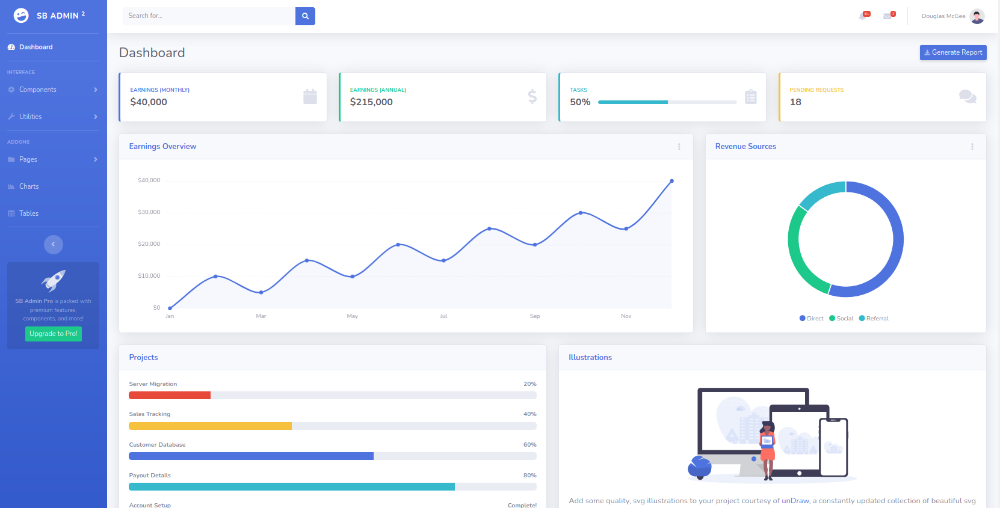

# staradmin-demo

Spring Boot with Thymeleaf and Star Admin 

# staradmin-demo

Spring Boot with Thymeleaf and Star Admin 

## Installation

~~~sh

$> cd src/main/resources
$> git clone https://github.com/startbootstrap/startbootstrap-sb-admin-2 static
$> cd static 
$> rm -rf .git 

~~~

## Screenshot

